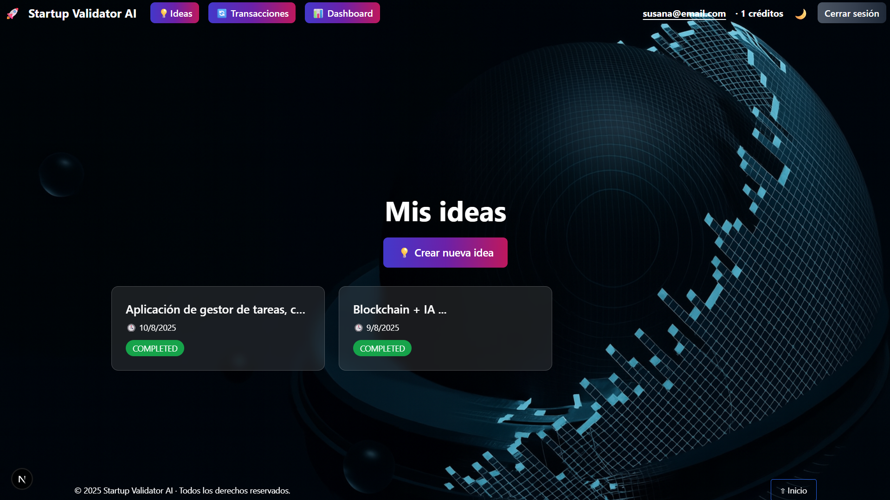
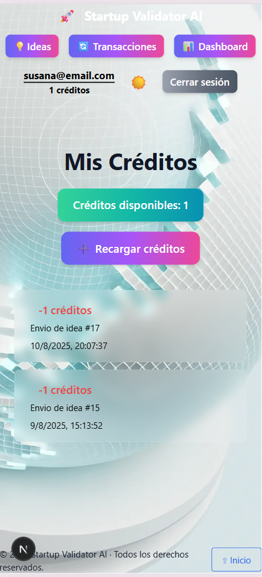
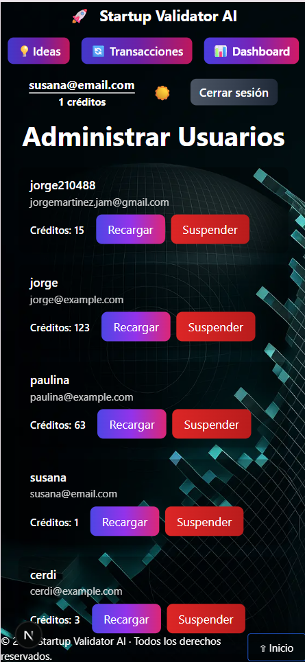
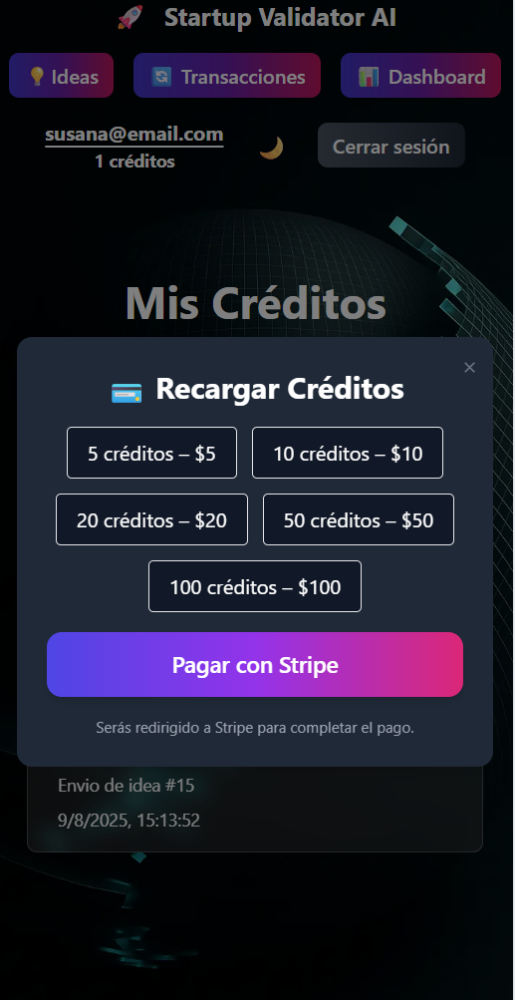
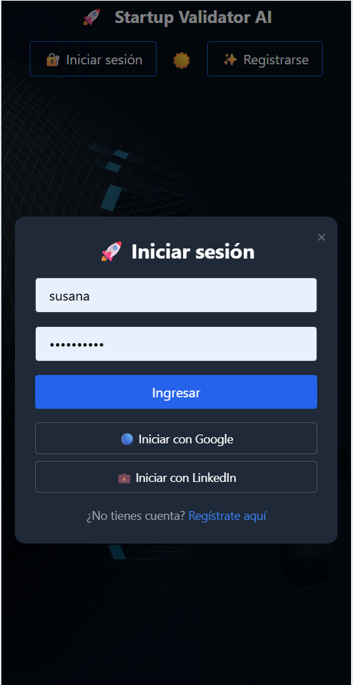

Perfecto, aquí tienes el **README** ajustado y consistente, manteniendo toda tu información y el mismo formato:

---

# Startup Validator AI








---

## Description

**Startup Validator AI** is an AI-powered platform that helps founders refine and validate startup ideas.
Users submit their idea, and the system automatically processes it in the background to deliver:

- an improved and more compelling description,
- a suggested brand name and AI-generated logo,
- a recommended target audience,
- a list of key technologies,
- and a complete SWOT analysis.

The platform also provides an intuitive interface for browsing submitted ideas, tracking credit balance, and purchasing additional credits via **Stripe**.
Administrators have dedicated views to manage all registered users, including the ability to recharge credits for them, suspend or re-enable accounts, and monitor overall activity.

It integrates **real-time notifications**, **email alerts**, **Google social login**, a **credit-based system** for idea submissions, and **Stripe payments** for seamless credit top-ups.

---

## Tech Stack

### Backend

- **Django + Django REST Framework** – REST API
- **SimpleJWT** – JWT authentication
- **dj-rest-auth + django-allauth** – Google social login
- **Celery + Redis** – background workers
- **OpenAI API** – text & image generation
- **Stripe** – credit top-ups & checkout
- **Django Channels + Redis** – WebSocket layer (notifications)
- **Email (SMTP)** – transactional emails

### Frontend

- **Next.js** – React framework with server-side rendering.
- **React** – Component-based UI library.
- **TypeScript** – Static typing for better maintainability.
- **TailwindCSS** – Utility-first CSS framework.
- **Zustand** – Lightweight state management.
- **Framer Motion** – Animations and transitions.
- **Lucide React** – Icon set.
- **React Hot Toast** – Toast notifications.
- **React Icons** – Icon library.
- **Axios** – HTTP requests to backend APIs.
- **@react-oauth/google** – Google OAuth integration.
- **JWT Decode** – Token decoding and session management.
- **Next Themes** – Theme switching.

### Database

- **Django ORM** (default dev setup uses **SQLite**; configurable for PostgreSQL/MySQL)

---

## How to Run the Application

> This project runs with **Docker Compose** (Django API, Celery worker, Redis).
> Make sure you have **Docker** and **Docker Compose** installed.

### Clone the repository

```bash
git clone <repository_url>
```

---

## Backend

### 1️⃣ Navigate to the Backend Directory

```bash
cd backend
```

### 2️⃣ Create the `.env` file (backend)

Create `.env` with your secrets (placeholders shown below):

```env
# Django
SECRET_KEY=<your_secret_key>
DEBUG=True
ALLOWED_HOSTS=localhost,127.0.0.1

# OpenAI
OPENAI_API_KEY=<your_openai_key>

# Redis (Celery/Channels)
REDIS_URL=redis://redis_validator:6379/0

# Email (SMTP)
EMAIL_HOST=<smtp_host>
EMAIL_HOST_USER=<smtp_user>
EMAIL_HOST_PASSWORD=<smtp_password>
EMAIL_PORT=2525
EMAIL_USE_TLS=True

# Google OAuth
SOCIAL_AUTH_GOOGLE_CLIENT_ID=<google_client_id>
SOCIAL_AUTH_GOOGLE_SECRET=<google_client_secret>
GOOGLE_REDIRECT_URI=http://localhost:3000/auth/google/callback

# Stripe
STRIPE_SECRET_KEY=<stripe_secret>
STRIPE_PUBLISHABLE_KEY=<stripe_publishable>
STRIPE_PRICE_5=<stripe_price_id_5>
STRIPE_PRICE_10=<stripe_price_id_10>
STRIPE_PRICE_20=<stripe_price_id_20>
STRIPE_PRICE_50=<stripe_price_id_50>
STRIPE_PRICE_100=<stripe_price_id_100>
STRIPE_SUCCESS_URL=http://localhost:3000/payment/success
STRIPE_CANCEL_URL=http://localhost:3000/payment/cancel
STRIPE_WEBHOOK_SECRET=<stripe_webhook_secret>

# Frontend URL
FRONTEND_URL=http://localhost:3000
```

> Keep secrets out of source control.

### 3️⃣ Start services

From `backend/`:

```bash
docker compose up --build
```

Services started:

- **Django API** at `http://localhost:8000/api/`
- **Redis** exposed on host port `6381`
- **Celery worker** (auto-started)

### 4️⃣ Apply migrations & create admin

In a new terminal:

```bash
docker compose exec django python manage.py migrate
docker compose exec django python manage.py createsuperuser
```

### 5️⃣ Configure Google Login (Django Admin)

1. Go to `http://localhost:8000/admin/` and sign in.
2. **Sites** → edit Site (id=1) → set domain to `localhost:8000`.
3. **Social applications** → **Add**:

   - **Provider**: Google
   - **Client id** / **Secret key**: from Google Cloud
   - **Chosen sites**: select `localhost:8000` and also add your frontend host (e.g., `localhost:3000`)

---

## API Endpoints

Base path: **`/api/`**

### Auth

- `POST /api/login/` – obtain JWT (username/password)
- `POST /api/dj-rest-auth/google/` – Google login (expects `{ "access_token": "..." }`)
- `GET  /api/me/` – current user profile

### Ideas

- `POST /api/submit-idea/` – submit idea text; queues background analysis; consumes 1 credit
- `GET  /api/my-ideas/` – list current user’s ideas
- `GET  /api/ideas/<idea_id>/` – retrieve a single idea
- `PATCH /api/ideas/<idea_id>/make-public/` – make your idea public
- `GET  /api/ideas/public/` – list public ideas

### Credits & Admin

- `GET  /api/my-credit-transactions/` – your credit history
- `POST /api/admin-recargar-creditos/` – (admin) add credits
- `GET  /api/admin-users/` – (admin) list users
- `POST /api/admin-suspender-usuario/` – (admin) suspend a user
- `POST /api/admin-habilitar-usuario/` – (admin) re-enable a user

### Stripe

- `POST /api/stripe/create-payment/` – create Stripe checkout session
- `POST /api/stripe/confirm-payment/` – confirm session and add credits
- `POST /api/stripe/webhook/` – handle Stripe events

> Token endpoints also available:
>
> - `POST /api/token/`
> - `POST /api/token/refresh/`

---

## Frontend

### 1️⃣ Navigate to the Frontend Directory

```bash
cd ..
cd frontend
```

### 2️⃣ Install Dependencies

```bash
npm install
```

### 3️⃣ Set Up Environment Variables

Create a `.env` file inside the **frontend** directory with the required configuration for:

- **Backend API URL**
- **Google Client ID**
- **Google Redirect URI**

Example:

```env
NEXT_PUBLIC_API_URL=<Backend API base URL>
NEXT_PUBLIC_GOOGLE_CLIENT_ID=<Your Google Client ID>
NEXT_PUBLIC_GOOGLE_REDIRECT_URI=<Your redirect URI>
```

### 4️⃣ Start the Frontend in Development Mode

```bash
npm run dev
```

The application will be available at:

```
http://localhost:3000
```
